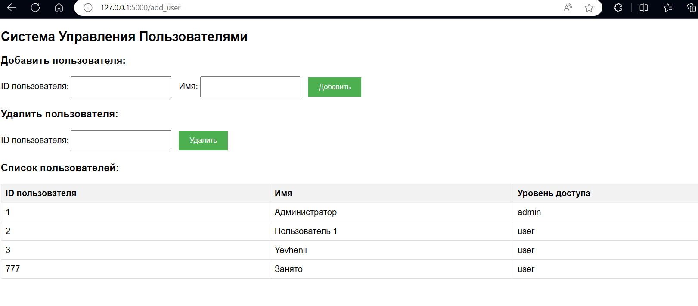

# OB02_UserManagementSystem
User Management System for a small company. This repository contains the Python code for managing user accounts, with two main classes: User for regular employees and Admin for administrators.
GPT
Here's a more light-hearted and emoji-enhanced summary of the work done on developing a user management system using Flask and HTML:

## Overview

Cooked up a nifty little web-based user management system for a company 
that likes to keep things orderly 📚. We've got regular workers (users) and
the big bosses (admins). The system was spun up using Python and Flask for
the backend magic 🧙‍♂️, and HTML to make everything look snazzy on the front.

## Backend Implementation

### Python Classes:

Whipped up a User class to keep track of folks by their ID, name, and
whether they're just hanging out or running the show (access level).
Rustled up an Admin subclass that inherits the chill vibes from User but 
with extra superpowers 🦸‍♂️ to add and zap users from the system.

### Flask Setup:

Booted up a Flask app to handle the chit-chat between the website and the server.
Rolled out routes that serve up forms for humans to interact with and manage those pesky user additions and removals.

### User Management:

Kept a cozy little list of users that can be tweaked by the admins 
whenthey feel like shaking things up.
Made sure no one could sneak in a clone (duplicate user ID) or ghost 
someone who doesn’t exist (removing non-existent users) 👻.
Frontend Implementation

### HTML Forms:
Crafted some snappy forms for adding newbies and booting out the oldies,
which talk directly to our Flask overlord.
Chose POST methods for these forms because we like keeping secrets (and user data) safe.
User Interface:

Dressed up the pages in some basic CSS to not look like a 90s hacker movie 🎥.
Displayed a dynamic table showing all the user info—sort of like a fancy dinner party seating chart but for user data.

### Localization:

Flipped everything into Russian for our comrades, making sure all text 
was as welcoming as a matryoshka doll in a babushka’s house 🇷🇺.
Set the lang attribute to "ru" because, well, when in Russia...
Execution
Just run this baby locally and Flask does the heavy lifting, acting as 
both maître d' and chef in our little digital bistro. Users can pop over
to http://localhost:5000/ and see it all in action.

## Conclusion

We’ve stitched together a user management system that’s as fun as it is functional, blending Python's backend prowess with some straightforward HTML frontend flair. It’s perfect for performing the admin dance of adding and removing users without missing a beat 💃🕺.